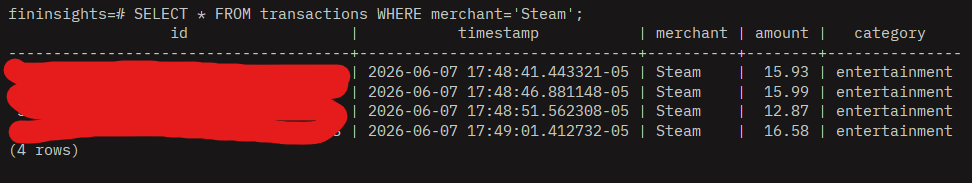
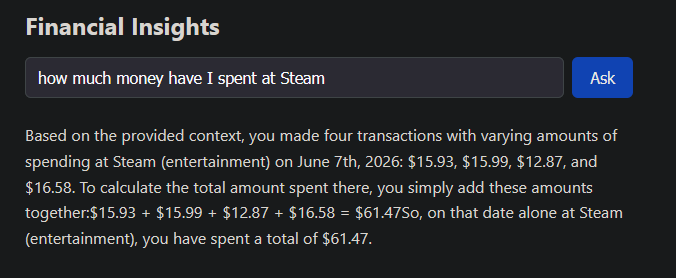

# real-time-transaction-insights

A local, end-to-end real-time financial insights platform. Simulated card transactions stream through Kafka into two independent consumers — one that stores and embeds them into a vector database, and one that computes per-merchant aggregations. A user can then ask natural-language questions in a web UI and get streamed, context-grounded answers from a local LLM via a retrieval-augmented generation (RAG) pipeline.

Everything runs locally — no Docker and no external API keys. All inference (embeddings and completions) runs on-device through Ollama.

## Demo

**Sample query — natural-language question answered by the RAG pipeline, streamed token-by-token into the React UI:**



**Database ground truth — the `transactions` table in psql, confirming the LLM's answer is accurate:** the four Steam transactions ($15.93, $15.99, $12.87, $16.58) sum to exactly the **$61.47** the model reported above.



## Architecture

```
                          ┌──────────────┐
                          │  producer.py │  generates synthetic transactions
                          └──────┬───────┘
                                 │ JSON
                                 ▼
                    ┌─────────────────────────┐
                    │   Kafka: transactions    │  (KRaft, single topic)
                    └───────────┬─────────────┘
                  consumer group│       │consumer group
                    "embedder"  │       │ "streams-app"
                                ▼       ▼
                  ┌──────────────┐   ┌─────────────────┐
                  │  embedder.py │   │ StreamsApp.java │
                  │  embed +     │   │ per-merchant    │
                  │  store raw   │   │ aggregations    │
                  └──────┬───────┘   └────────┬────────┘
                         │                    │
                         ▼                    ▼
        ┌──────────────────────────────────────────────────┐
        │            PostgreSQL  +  pgvector                 │
        │  transactions │ transaction_embeddings │ aggregations
        └───────────────▲───────────────▲────────────────────┘
                        │ vector search  │ aggregates
                        │                │
                  ┌─────┴────────────────┴─────┐        ┌──────────┐
                  │          rag.go            │◄──────►│  Ollama  │
                  │  embed query → retrieve →  │  embed │ (local   │
                  │  build prompt → stream LLM │  + chat│  models) │
                  └─────────────▲──────────────┘        └──────────┘
                                │ gRPC stream (tokens)
                                │
                       ┌────────┴────────┐
                       │   gateway.go    │  HTTP + Server-Sent Events
                       └────────▲────────┘
                                │ SSE (tokens)
                                │
                        ┌───────┴────────┐
                        │  App.jsx (React)│  streams the answer live
                        └─────────────────┘
```

**Ingestion path:** `producer.py` publishes transactions to a single Kafka topic. Two independent consumers read it: `embedder.py` stores each raw transaction and its 768-dim embedding into PostgreSQL/pgvector, while `StreamsApp.java` maintains per-merchant aggregations (revenue, average, count, anomaly flag).

**Query path:** the React app POSTs a question to `gateway.go`, which opens a gRPC stream to `rag.go`. The RAG service embeds the question, runs a pgvector similarity search, pulls relevant entries, builds a prompt, and streams a completion from Ollama. Tokens flow back over gRPC → SSE → the browser, rendering live.

## Technologies Used

- **Python** — runs `producer.py` (synthetic transaction generator) and `embedder.py` (Kafka consumer that embeds and stores transactions).
- **Apache Kafka (KRaft mode)** — the streaming backbone; a single `transactions` topic fans out to the two independent consumers.
- **Kafka Streams (Java)** — computes running per-merchant aggregations (revenue, average, count, anomaly flag) and writes them to PostgreSQL.
- **PostgreSQL** — the relational store for raw transactions and per-merchant aggregations.
- **pgvector** — PostgreSQL extension providing the `vector` type and cosine-similarity search used for embedding retrieval.
- **Ollama** — local model server running `nomic-embed-text` for embeddings and `phi3.5` for completions, so no external API keys are needed.
- **Go** — implements the `rag.go` RAG service and the `gateway.go` HTTP gateway.
- **gRPC** — streaming transport between the gateway and the RAG service, enabling token-by-token delivery as the LLM generates.
- **Protocol Buffers** — defines the `RAG.Query` service contract that the Go stubs are generated from.
- **React + Vite** — the single-page frontend where users ask questions and watch answers stream in.
- **Server-Sent Events (SSE)** — streams tokens from the gateway to the browser over plain HTTP.
